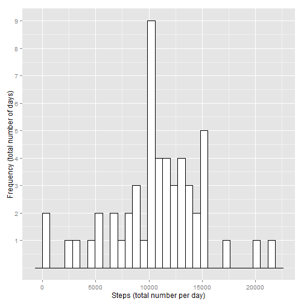
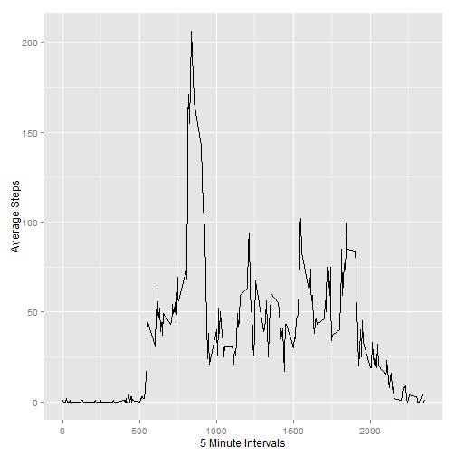
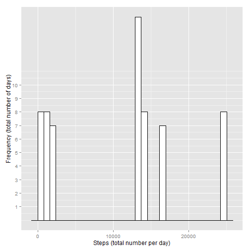
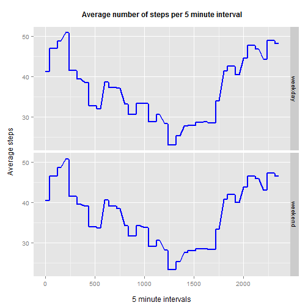

Reproducible Research Peer Assessment 1: Analyzing Wearable Activity Data
==========================================================================================================
    
### Introduction
It is now possible to collect a large amount of data about personal movement using activity monitoring devices such as a Fitbit, Nike Fuelband, or Jawbone Up. These type of devices are part of the "quantified self" movement - a group of enthusiasts who take measurements about themselves regularly to improve their health, to find patterns in their behavior, or because they are tech geeks. But these data remain under-utilized both because the raw data are hard to obtain and there is a lack of statistical methods and software for processing and interpreting the data.

This assignment makes use of data from a personal activity monitoring device. This device collects data at 5 minute intervals through out the day. The data consists of two months of data from an anonymous individual collected during the months of October and November, 2012 and include the number of steps taken in 5 minute intervals each day.

### Data
The data for this assignment was downloaded from the course web site

The variables included in this dataset are:
    
* steps: Number of steps taking in a 5-minute interval (missing values are coded as NA)

* date: The date on which the measurement was taken in YYYY-MM-DD format

* interval: Identifier for the 5-minute interval in which measurement was taken

The dataset is stored in a comma-separated-value (CSV) file and there are a total of 17,568 observations in this dataset.

### Assignment
This assignment will be described in multiple parts. We had to write a single (markdown-)report that answers several questions (see below):
    
__0. Set up basic parameters__

Load commonly used custom functions into workspace

```r
source("../common/session.R")
source("../common/downloader.R")
source("../common/na_strings.R")
source("../common/trim.R")
```

The following libraries were used:

```r
library(knitr)
library(ggplot2)
```

Log session information for debugging

```r
orig_loc <- Sys.getlocale("LC_TIME")
session <- sessInfo(clear=TRUE, loc=c("LC_TIME", "English"), log=TRUE)
```

Set up current project directory

```r
inputDir <- getwd()
```

Set up data directory

```r
dataDir <- file.path(inputDir,"data")
```

Set up source file name (full file path)

```r
dataset <- file.path(dataDir,"repdata-data-activity.zip")
```

Set up source file URL

```r
url <- "http://d396qusza40orc.cloudfront.net/repdata%2Fdata%2Factivity.zip"
```

__1. Loading and preprocessing the data__

Download source file

```r
downloadFile(dataDir, dataset, url)
```

Unzip source file

```r
data.source <- unzip(dataset, exdir = dataDir)
```

Reading-in the dataset <span style="color:red">activity.csv</span>. I have specified several strings (<span style="color:red">"?","", "NA", "N/A", "NULL"</span>), that will be converted to <span style="color:red">NA</span>. Further, the colClasses for every column are already defined. There were no additional preprocessing steps executed: 

```r
data.1 <- read.csv(data.source, header = TRUE, sep = ",", 
                   na.strings = getNaStrings(), 
                   stringsAsFactors = FALSE, colClasses=c("integer","Date", "integer"))
```

First rows of the dataset:

```
##   steps       date interval
## 1    NA 2012-10-01        0
## 2    NA 2012-10-01        5
## 3    NA 2012-10-01       10
## 4    NA 2012-10-01       15
## 5    NA 2012-10-01       20
## 6    NA 2012-10-01       25
```

Summary Statistics of the dataset:

```
##      steps             date               interval     
##  Min.   :  0.00   Min.   :2012-10-01   Min.   :   0.0  
##  1st Qu.:  0.00   1st Qu.:2012-10-16   1st Qu.: 588.8  
##  Median :  0.00   Median :2012-10-31   Median :1177.5  
##  Mean   : 37.38   Mean   :2012-10-31   Mean   :1177.5  
##  3rd Qu.: 12.00   3rd Qu.:2012-11-15   3rd Qu.:1766.2  
##  Max.   :806.00   Max.   :2012-11-30   Max.   :2355.0  
##  NA's   :2304
```

__2. What is mean total number of steps taken per day?__

Make a histogram of the total number of steps taken each day. In order to derive the total number of daily steps, I have summed the step variable over the date variable and stored the result in a temporary dataframe. After renaming the columns, I have generated the histogram using ggplot:
    

```r
numSteps.1 <- aggregate(data.1$steps, list(data.1$date), sum)
colnames(numSteps.1)[1] <- "date"
colnames(numSteps.1)[2] <- "total_daily_steps"
hist.1 <- ggplot(numSteps.1, aes(x=numSteps.1$total_daily_steps)) +
    geom_histogram(fill="white", colour = "black") + 
    xlab("Steps (total number per day)") + 
    scale_y_continuous("Frequency (total number of days)", breaks = c(1:10))

print(hist.1)
```

 

Calculate and report the mean and median total number of steps taken per day. The numbers are rounded off to a whole number:

```r
meanSteps.1 <- as.integer(mean(numSteps.1$total_daily_steps, na.rm = TRUE))
print(meanSteps.1)
```

```
## [1] 10766
```

```r
medianSteps.1 <- as.integer(median(numSteps.1$total_daily_steps, na.rm = TRUE))
print(medianSteps.1)
```

```
## [1] 10765
```

__3. What is the average daily activity pattern?__

***
    
Remark - The interval variable has not been converted to time format, due to the following aspects:
    
1. All relevant interval data is filtered and displayed correctly in the plot without the formatting
2. The interval data is not linear

***
    
Make a time series plot (i.e.<span style="color:red">type = "l"</span>) of the 5-minute interval (x-axis) and the average number of steps taken, averaged across all days (y-axis):

```r
aveSteps.1 <- aggregate(data.1$steps~data.1$interval, data.1, function(x) as.integer(mean(x, na.rm = TRUE)))
colnames(aveSteps.1)[1] <- "interval"
colnames(aveSteps.1)[2] <- "average_steps"
line.1 <- ggplot(aveSteps.1, aes(x=aveSteps.1$interval, y=aveSteps.1$average_steps)) +
    geom_line(colour = "black") + 
    xlab("5 Minute Intervals") + 
    ylab("Average Steps")

print(line.1) 
```

 

Which 5-minute interval, on average across all the days in the dataset, contains the maximum number of steps?

```r
maxSteps <- subset(aveSteps.1, aveSteps.1$average_steps == max(aveSteps.1$average_steps),
                   Select=aveSteps.1$interval)
print(maxSteps)
```

```
##     interval average_steps
## 104      835           206
```

__4. Imputing missing values__

Calculate and report the total number of missing values in the dataset (i.e. the total number of rows with NAs):

```r
imputeNa <- data.1[!complete.cases(data.1),]
missingVal <- nrow(imputeNa)
print(missingVal)
```

```
## [1] 2304
```

Devise a strategy for filling in all of the missing values in the dataset. Create a new dataset that is equal to the original dataset but with the missing data filled in. I have replaced the missing values with the average steps per time interval across all days (see 3.):

```r
imputeNa <- merge(aveSteps.1, imputeNa, by="interval", all=FALSE, sort=FALSE)
imputeNa <- imputeNa[,c("average_steps","date","interval")]
colnames(imputeNa)[1] <- "steps"

data.2 <- data.frame(
    steps=ifelse(data.1$interval %in% imputeNa$interval, imputeNa$steps, data.1$steps),
    date=data.1$date,
    interval=data.1$interval)
```

First rows of the dataset:

```
##   steps       date interval
## 1     1 2012-10-01        0
## 2     1 2012-10-01        5
## 3     1 2012-10-01       10
## 4     1 2012-10-01       15
## 5     1 2012-10-01       20
## 6     1 2012-10-01       25
```

Summary Statistics of the dataset:

```
##      steps             date               interval     
##  Min.   :  0.00   Min.   :2012-10-01   Min.   :   0.0  
##  1st Qu.:  2.00   1st Qu.:2012-10-16   1st Qu.: 588.8  
##  Median : 33.50   Median :2012-10-31   Median :1177.5  
##  Mean   : 36.97   Mean   :2012-10-31   Mean   :1177.5  
##  3rd Qu.: 52.00   3rd Qu.:2012-11-15   3rd Qu.:1766.2  
##  Max.   :206.00   Max.   :2012-11-30   Max.   :2355.0
```

Make a histogram of the total number of steps taken each day and Calculate and report the mean and median total number of steps taken per day:

```r
numSteps.2 <- aggregate(data.2$steps, list(data.2$date), sum)
colnames(numSteps.2)[1] <- "date"
colnames(numSteps.2)[2] <- "total_daily_steps"
hist.2 <- ggplot(numSteps.2, aes(x=numSteps.2$total_daily_steps)) +
    geom_histogram(fill="white", colour = "black") + 
    xlab("Steps (total number per day)") + 
    scale_y_continuous("Frequency (total number of days)", breaks = c(1:10))

print(hist.2)
```

 


```r
meanSteps.2 <- as.integer(mean(numSteps.2$total_daily_steps, na.rm = TRUE))
print(meanSteps.2)
```

```
## [1] 10647
```

```r
medianSteps.2 <- as.integer(median(numSteps.2$total_daily_steps, na.rm = TRUE))
print(medianSteps.2)
```

```
## [1] 13664
```
Do these values differ from the estimates from the first part of the assignment? Yes, the values differ from the first part of the assignment (see 2.)

What is the impact of imputing missing data on the estimates of the total daily number of steps? The mean and median values are diverging from another and one may clearly see the different interpretations for measures of central tendency

__5. Are there differences in activity patterns between weekdays and weekends?__

Create a new factor variable in the dataset with two levels - "weekday" and "weekend" indicating whether a given date is a weekday or weekend day:

```r
data.2$day_trigger <- as.factor(ifelse(weekdays(data.2$date) %in% c("Sunday", "Saturday"),"weekend","weekday"))
```

Make a panel plot containing a time series plot (i.e. type = "l") of the 5-minute interval (x-axis) and the average number of steps taken, averaged across all weekday days or weekend days (y-axis).


```r
aveSteps.2 <- aggregate(data.2$steps~data.2$day_trigger+data.2$interval,data.2,mean)
colnames(aveSteps.2)[1] <- "day_trigger"
colnames(aveSteps.2)[2] <- "interval"
colnames(aveSteps.2)[3] <- "average_steps"
line.2 <- ggplot(aveSteps.2, aes(x=interval, y=average_steps)) +
    geom_line(colour = "blue", size = 1) +
    labs(title = "Average number of steps per 5 minute interval\n", x = "\n5 minute intervals", y = "Average steps\n") +
    theme(axis.title=element_text(size=12)) + 
    theme(plot.title = element_text(size = 12, face = "bold")) +
    facet_grid(day_trigger ~ .)

print(line.2)
```

 

First rows of the dataset:

```
##   steps       date interval day_trigger
## 1     1 2012-10-01        0     weekday
## 2     1 2012-10-01        5     weekday
## 3     1 2012-10-01       10     weekday
## 4     1 2012-10-01       15     weekday
## 5     1 2012-10-01       20     weekday
## 6     1 2012-10-01       25     weekday
```

Summary Statistics of the dataset:

```
##      steps             date               interval       day_trigger   
##  Min.   :  0.00   Min.   :2012-10-01   Min.   :   0.0   weekday:12960  
##  1st Qu.:  2.00   1st Qu.:2012-10-16   1st Qu.: 588.8   weekend: 4608  
##  Median : 33.50   Median :2012-10-31   Median :1177.5                  
##  Mean   : 36.97   Mean   :2012-10-31   Mean   :1177.5                  
##  3rd Qu.: 52.00   3rd Qu.:2012-11-15   3rd Qu.:1766.2                  
##  Max.   :206.00   Max.   :2012-11-30   Max.   :2355.0
```

Finally, set locale back to original

```r
session <- sessInfo(clear=TRUE, loc=c("LC_TIME", orig_loc), log=TRUE)
```
